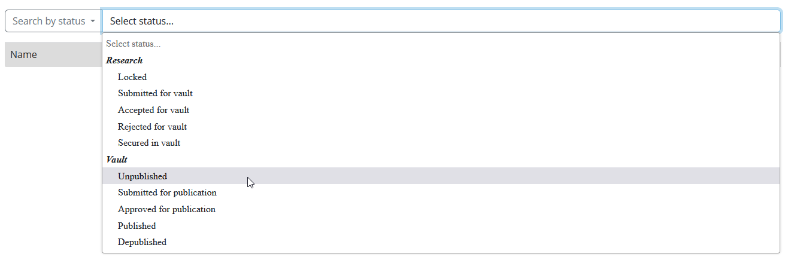

# Finding and restoring data

You might want to search for data files or folders in your research group, especially when the amount of data you are working with is growing or when you have many different research groups of folders you work in. It is also possible to retrieve an earlier version (a revision) of a file, for example if you have accidently deleted a file. With the ‘search’ functionality in Yoda, you can do both.

## Finding files and folders

Follow these steps to search for files or folders in Yoda.

1) Go to the Yoda portal and sign in.
2) Click on 'Research' in the menu (the grey bar).

Above the menu is the ‘quick search’ entry. This will search for matching file names.

Once the search is done you can refine or renew the search with more search options, with the search bar just below the menu.

You can select specific components in the drop-down menu to the left of the search bar.

##Search by filename / search by folder

If you know (part of) the name of the file or folder you are looking for, use this as ‘Search term’.

A search by name will find files and folders with the search term in its name. Typing a series of letters will reveal all files and (sub)folders containing that series in the name. For example, searching on “er” will result in finding:

- “er”
- “Er”
- “Ergonomics”
- “Folder A”

## Search by metadata

The search by metadata will search in the contents of the fields in the metadata form. It reveals all fields containing your search term.

At first you will see the number of fields and hovering over it will show exactly which field contains the search term.

## Search by status

You can also search by status in the vault.

## Restoring previous file versions

Previous file versions (revisions) are important if you need to go back to an earlier version of your work. Yoda provides you with a backup functionality of these earlier versions. This is very useful and means that you can restore files yourself.

Yoda saved a new revision of your data every time you save a file using the same name. Yoda does not overwrite the existing file, but creates a new revision while the older revision is stored in a hidden location. This then becomes a previous file version that you can restore if needed.

As time passes by, an increasing amount of the revisions will be deleted. This means that you can restore many revisions from the same day, less revisions from the last few days, even less revisions from a week back, etcetera. After 16 weeks, every revision older than 16 weeks is deleted.

Follow these steps to restore older file versions:

1) Go to the Yoda portal and sign in.

2) Click on 'Research' in the menu (the black bar). There is a search bar just below the menu.

3) Select ‘Search revisions by name’.

4) Type the name of a file of which you want to restore a revision.

5) Click on a file. You will now see the file versions in the search results.

6) You can save the file version you wish to restore in various ways:
- under your own name in the same folder
- with a different name
- in another folder within the research group

Note that Microsoft’s autosave functionality does not function in combination with file storage via internet. Therefore it does not function in Yoda.

Note that during your work a maximum of one revision per 60 seconds is made. Any changes within 60 seconds of the last revision will not form a new revision even though you saved it in the meantime.

## Other restore options
A daily backup is made of all data in the Yoda Research space. 
If you can't restore the file via the revisions or if you need to restore an entire folder structure please contact
the Research Support Desk at researchdatamanagement@vu.nl for other restore options.  