# Using Cyberduck with Yoda

Cyberduck is desktop software for Microsoft Windows 10 and Apple OSX that can be used to transfer files between your computer and Yoda. In this guide we will explain how to install Cyberduck, create a new connection (bookmark) to Yoda and end with some frequently asked questions and tips on using Cyberduck

## Getting Cyberduck

**Apple OSX** : Cyberduck can be installed from the VU software center or downloaded from the internet.

**Microsoft Windows 10** : Download Cyberduck from [https://cyberduck.io/download/](https://cyberduck.io/download/) it is free and you **do not** need to register.

Run the downloaded installer by double clicking on "Cyberduck-installer.exe" which you will find in your Download folder in explorer. Install Cyberduck with the default options, and once that is done launch Cyberduck from the start menu.

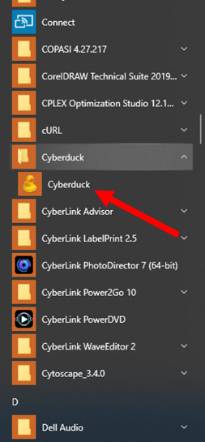

## Configuring Cyberduck

<!--
### Accessing Cyberduck's settings

Cyberducks settings can be accessed by going to the Edit > preferences:

### Single threaded WebDAV copying

Before using Cyberduck you should change the following settings that ensure better data integrity and more reliable file transfers. First go to Cyberducks settings menu and Select "Transfers" from the top menu.

Make sure "Transfer Files" is set to "Open single connection" and that "Segmented downloads" is not selected (it is on by default). When using Cyberduck and webDAV it is strongly advised to use the single connection mode.

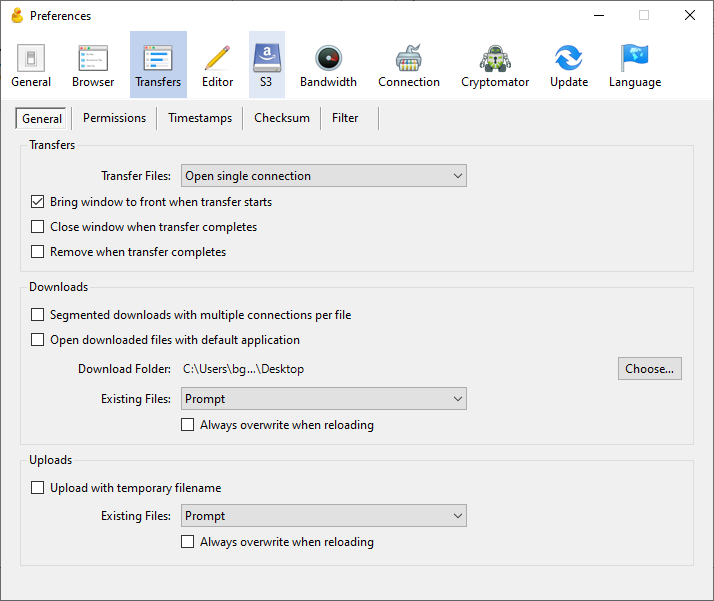

**Setting single connection mode**.

Close the settings by clicking the x on the top right of the window.
-->

## Create a new secure WebDAV (HTTPS) connection to Yoda (bookmark)

First create a new bookmark by pressing the + button on the lower left side of the screen.

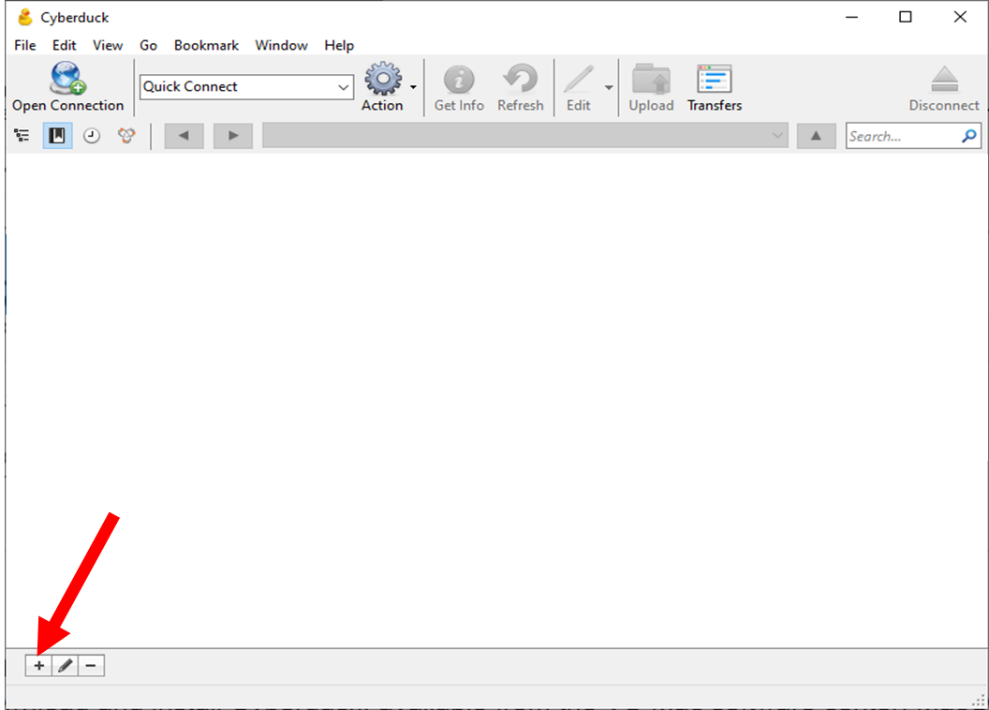

You will now see a new connection page:

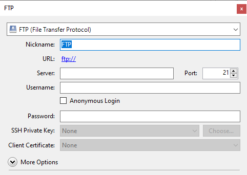

Click on the "FTP (File Transfer Protocol)" dropdown list and select a **WebDAV (HTTPS)** connection

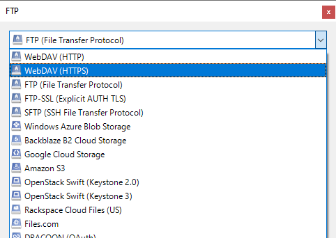

and you will see the WebDAV (HTTPS) connection page.

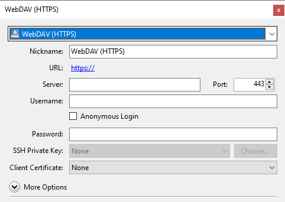

Fill in the following information in the appropriate blocks

First generate a [Data Access Password](data-access-password.md). 

- Server: **data.yoda.vu.nl**
- Username: your email address
- Password: paste (CTRL-v) the data access password you created in the portal. 

Cyberduck uses your home folder as a default directory to download files. This can be changed by clicking on "More Options" and choosing a new folder

You have successfully created a bookmark, close the editing window by clicking on the R X button on the top right of the edit window to return to the main Cyberduck screen.

## Connecting to Yoda

The main screen shows all the connections (bookmarks) you have defined. To connect, double click on the bookmark (in this case "data.yoda.vu.nl - WebDAV (HTTPS)") and you will be connected.

If you did not fill in your password in the bookmark you will be asked to do so now. Please note, "Save password" is automatically selected by Cyberduck, you may decide to (un)check this option. Fill in your vunet-id password and click " **Login**" to connect.

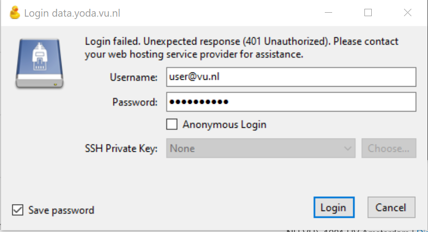

If your login unexpectedly fails, please check if your [data access password](data-access-password.md) is still valid.

You should now see your project directory in an explorer like window:

## Working with Yoda folders and uploading/downloading files

Click on a \> to open a folder,

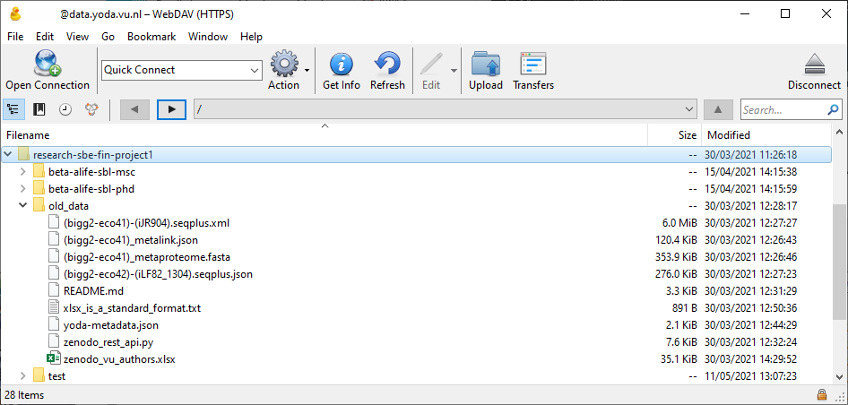

or double click to open in the main window.

Use the left, right and up arrows to navigate the directory tree and right click on the main window to create a new folder:

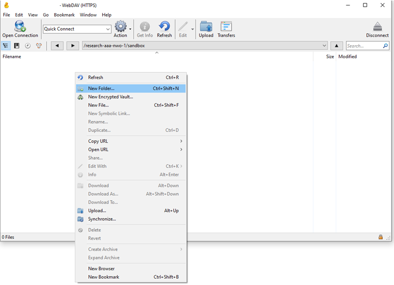

Alternatively, drag-and-drop folders and files from Windows Explorer to your Yoda project folders:

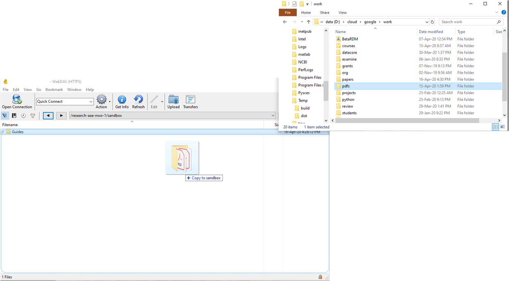

In either case, once copying has started you should see the transfer window. Keep this open until the transfer is complete. 

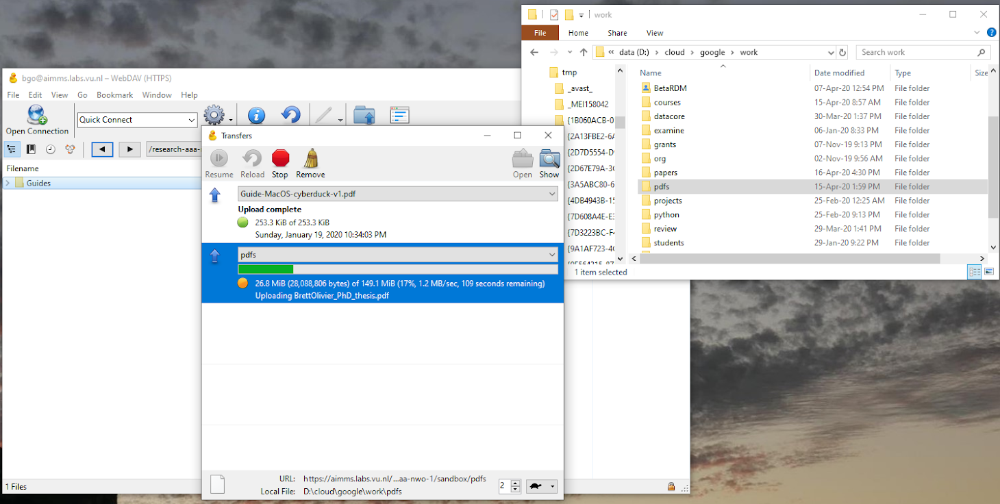

Alternatively, the context menu (activate by right clicking on a Yoda project file/directory) has a number of options for uploading, downloading and synchronizing files and folders:

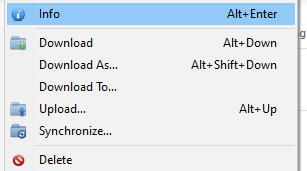

## Some things to consider when using Cyberduck/webDAV

### Total path and file length
When using Cyberduck you need to make sure that your path lengths (directories + filename) are less than 255 characters long. When using webDAV this is also true on the server side (Yoda) this includes server name, project name and project folders. Be careful when copying deep directory structures and very long filenames to Yoda using Cyberduck and webDAV. Fortunately, Cyberduck will display an error message and not copy theile when either trying to copy a file with a too long source or destination path. This error is typically "access denied" (403 or 500) error and if you click "continue" Cyberduck simply skips that file and it is not transferred to Yoda.

**Recommendation**. If you get "access denied errors" when transferring files with Cyberduck
- Make a note of which files fail to copy.
- Flatten the directory structure or shorten the filename.
- Zip the "main" directory branch(es) that contain the long path names into individual ZIP archives.

## Frequently asked questions

### Q1) When I try to delete a file, I get a "cannot delete \<filename\>" Cyberduck error.

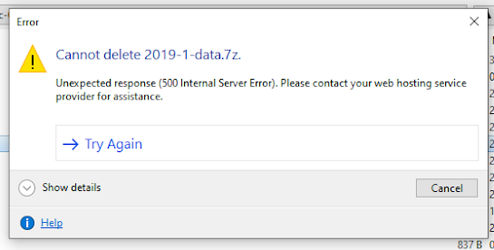

This error message can appear when the file/folder is read-only. Read only access can be a result of:

- The folder has been locked.
- You have been given read-only access to the project folder

_Answer: unlock the folder in the research portal or get project read/write access._

### Q2) I copy a file using Cyberduck, the transfer succeeds but I don't see the file in the portal.

The folder you are copying to is marked as read only. Read only access can be a result of:

- The folder has been locked in the Yoda portal
- You have been given read-only access to the project folder

_Answer: unlock the folder in the research portal or get project read/write access._

### Q3) I tried to delete a file but get an "Access denied" error message

One possibility is that the file has been corrupted during upload and is incorrectly registered in the iRODS database.

_Answer: Contact your data manager or iRODS administrator to fix the problem. Set Cyberduck to use single threaded WebDAV copying (See Appendix 1)_

## Cyberduck settings and functionality

### Accessing Cyberduck's settings

Cyberducks settings can be accessed by going to the Edit → preferences:

<!-- 
### Enabling checksum verification

Cyberduck can try to verify that a file was downloaded or uploaded using an internal checksum. To enable this functionality, first go to Cyberducks settings menu and Select "Transfers" from the top menu and the "Checksum" tab. Enable the upload/download verification as required. Enabling either of these options can **negatively** affect Cyberduck's file transfer performance, however, the **upload** option is highly recommended for ensuring **archive** data integrity.

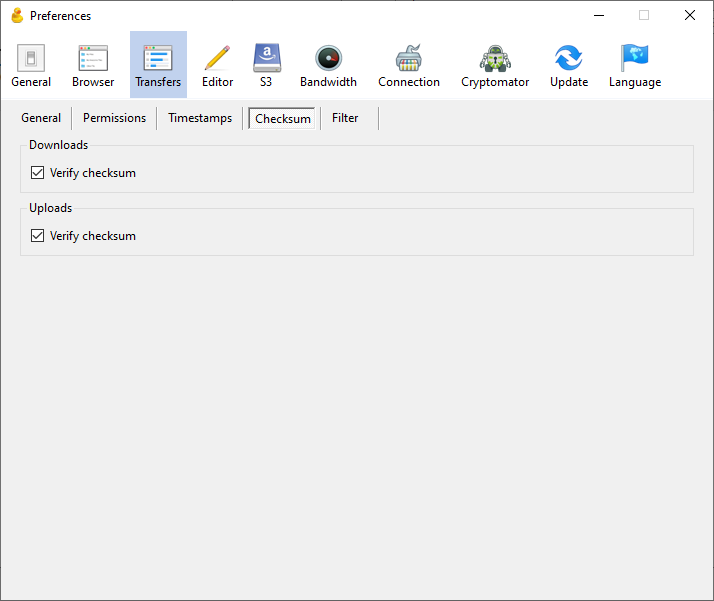

Close the preferences window to save your new configuration.
-->

