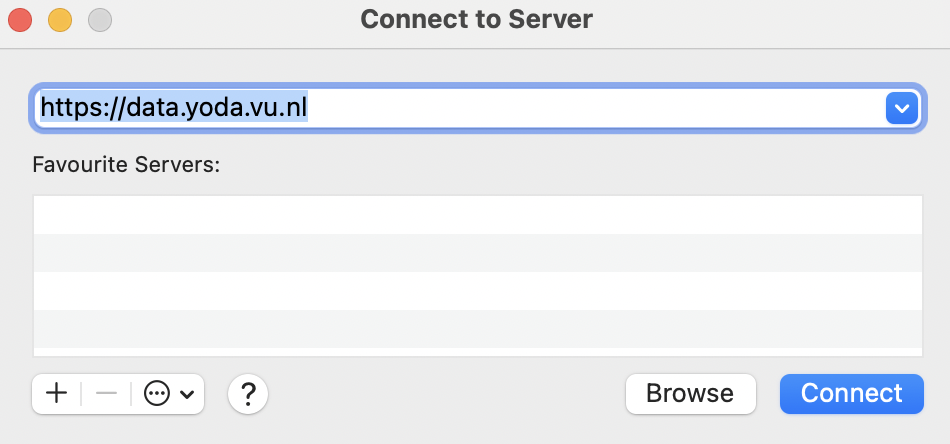

# Connecting to the Yoda Network Disk on macOS

These pages contains information about methods for connecting to
the Yoda Network Disk on PCs and laptops that run macOS. There are 2 basic ways to access the Yoda Network 
Disk from a Mac: [Mounting the Yoda Network Disk in finder](#mounting-the-yoda-network-disk-in-finder) or via file transfer tools, in which case we recommend [Cyberduck](yoda-disk-cyberduck.md). Which one works best
 depends on your workflow.

## Using Cyberduck
First fownload Cyberduck from the VU software center or from the [Cyberduck website](https://cyberduck.io/download/). 

Then configure Cyberduck using the [Information on configuring Cyberduck](yoda-disk-cyberduck.md).
Part of this process is [creating a Data Access Password](data-access-password.md)

## Mounting the Yoda Network Disk in Finder

You can open the Yoda Network Disk using the Finder app. By default, the Finder icon is shown in the bottom left corner of your screen, in the Dock. Click on this icon. 

If you don't see the Finder icon, you can alternatively start Finder by pressing the command key and the space bar, then typing "finder" and pressing enter.

Now press the command key and the "K" key to connect to the Yoda server. You should now see this dialog:

Enter https://data.yoda.vu.nl/ as server address.

The Finder app will show a confirmation dialog, similar to the one below. The address shown in the dialog should be the address you entered in the previous dialog.

Press the Connect button. 

You should now see a credentials dialog. The "Connect as" setting should be set to "Registered user".
"Name" should be your email address. Create a [Data Access Password](data-access-password.md) and copy it to the Password field. Tick the checkbox &ldquo;Remember this password
in my keychain&rdquo;.  Click on the connect button.

You should now have a new Yoda Network Disk location in Finder. Its name is the network address you entered before. You may have to scroll down in finder in order to see it.

