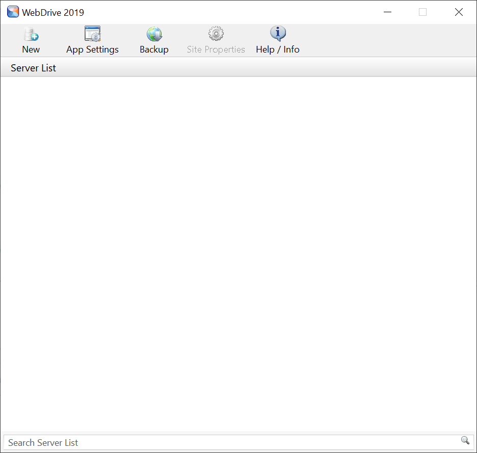
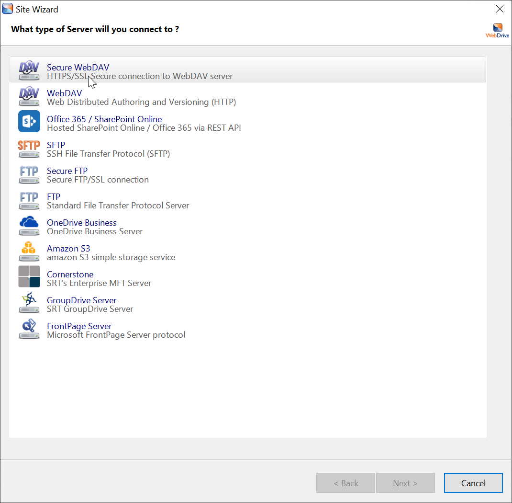
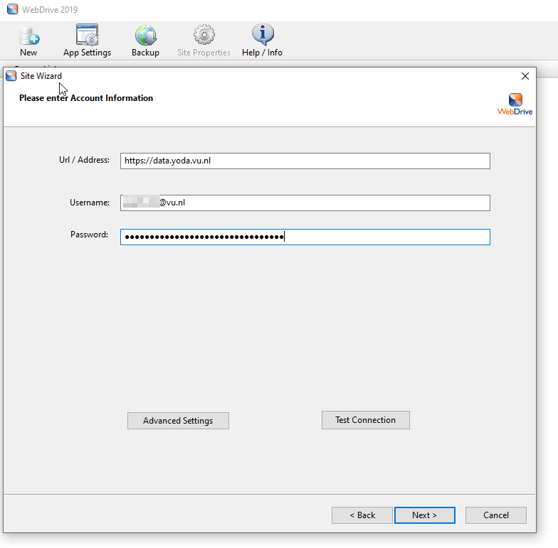

# Connecting to the Yoda Network Disk on Windows Using WebDrive

Windows users can use [WebDrive](https://webdrive.com/) to access their data via the Yoda Network Disk,
as an alternative to the [native WebDAV client](yoda-disk-windowsnative.md) and
[YodaDrive](yoda-disk-yodadrive.md). With WebDrive the Yoda Network Disk can be connected via as a drive in 
Windows Explorer. 

As a VU user you can download a licensed version of WebDrive from [download.vu.nl](https://download.vu.nl).
 

## Using WebDrive

Start Webdrive from the Desktop icon or the Start menu.

In the initial Window click new.

Choose Secure WebDAV and click Next.

Enter https://data.yoda.vu.nl/ in the Url/Address field.

Enter the Username (an emailaddress). Create a [data access password](data-access-password.md) and copy it to the Password field.
You can click Test Connection to see if the credentials are correct. 

Click Next

Choose a Drive letter and Connect Now. 

You should now see the Yoda Disk in your Windows Explorer.