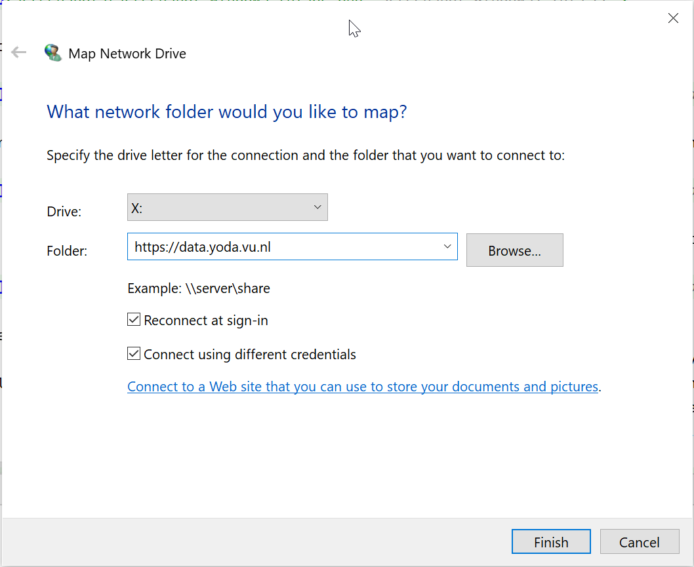
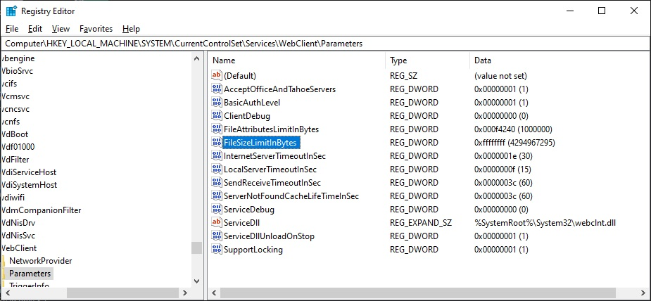
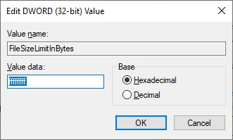

# Connecting to the Yoda Network Disk using the native Windows WebDAV client.

This page explains how to connect to the Yoda Network Disk from a Windows PC using the
native WebDAV client.

For most users, [YodaDrive](yoda-disk-yodadrive.md) is a better alternative. However, the Yoda team recommends
using the native WebDAV client in the following circumstances:
- If you need to be able to connect to multiple Yoda environments simultaneously.
- If you can't install YodaDrive, for example if the security settings of your laptop
  prevent you from installing any new applications.
- YodaDrive is intended for use with Windows 10. If you use Windows 7 and are unable to upgrade,
  you can still use the native WebDAV client to connect to the Yoda Network Disk as a temporary workaround.

If you have already configured a mapped network drive and want to update your password, please
consult the [instructions for updating your password](yoda-disk-windowsnative-update-passwd.md).

## Mapping network drive

Open "This PC" from the Start menu

Open the Computer menu item and select "Map network drive". 

 
Select a drive letter &mdash; any free letter is okay. Now enter the server address of the environment in the Folder field (see table below).

| Environment          | Address | Remarks                  |
|:-------------------- |:------------|:-------------------------|
| AIMMS pilot | https://aimms.labs.vu.nl/ | |
| Surf Pre-production | https://data.yoda.vu.nl/ | |

Ensure the box "Connect using different credentials" is checked and click on the Finish button. 

 
You will be prompted for a name and password.
If you are an employee or student at Utrecht University, your user name is your Utrecht University email address (in lowercase) and your password
is your Solis password. External users have usually received their user name via email, along with a link to set their password.
If you are working on your personal PC or laptop, tick the checkbox &ldquo;Remember my credentials&rdquo;. If you are working on a shared computer, it is
better not to tick this checkbox for security reasons. Click on the &ldquo;OK&rdquo; button.

 
The Explorer screen will show the folders you have access rights to. You
can now drag and drop your files to upload or download them.

## Increasing maximum file size

By default, the native WebDAV client only works with files smaller than 50 MB. You can increase this limit
to 4 GB if you have a local administrator account:
- Open the registry editor by pressing the start button, entering &ldquo;regedit&rdquo; and pressing the enter key.
- If you are asked whether the registry editor should be allowed to change the system settings, confirm.
- Navigate to key HKEY\_LOCAL\_MACHINE\SYSTEM\CurrentControlSet\Services\WebClient\Parameters
- Open the FileSizeLimitInBytes key

- Set it to FFFFFFFF (hexadecimal)

- Click on the &ldquo;OK&rdquo; button and close the registry editor
- Restart your computer
